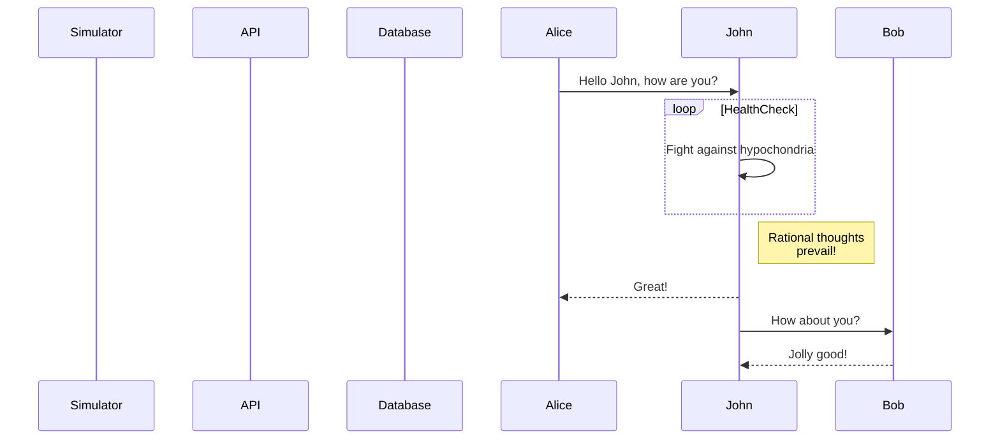
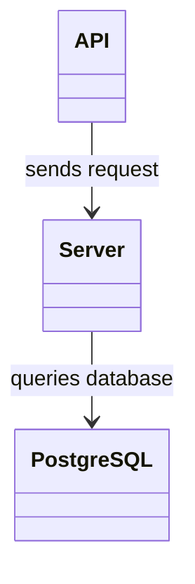

# DevOps, Software Evolution & Software Maintenance

## Group P - 2024

## Authors

| Name | Email |
|------|-------|
| Andreas Andrä-Fredsted | <aandr@itu.dk> |
| Christian Emil Nielsen | <cemn@itu.dk> |
| Michel Moritz Thies | <mithi@itu.dk> |
| Róbert Sluka | <rslu@itu.dk> |
| Bence Luzsinszky | <bluz@itu.dk> |

## System's Perspective

### Sequence diagram, simulator

### Sequence diagram, application

### Module Viewpoint

### Components Viewpoint

### Deplyoment Viewpoint

## Process' Perspective

## Lessons Learned
