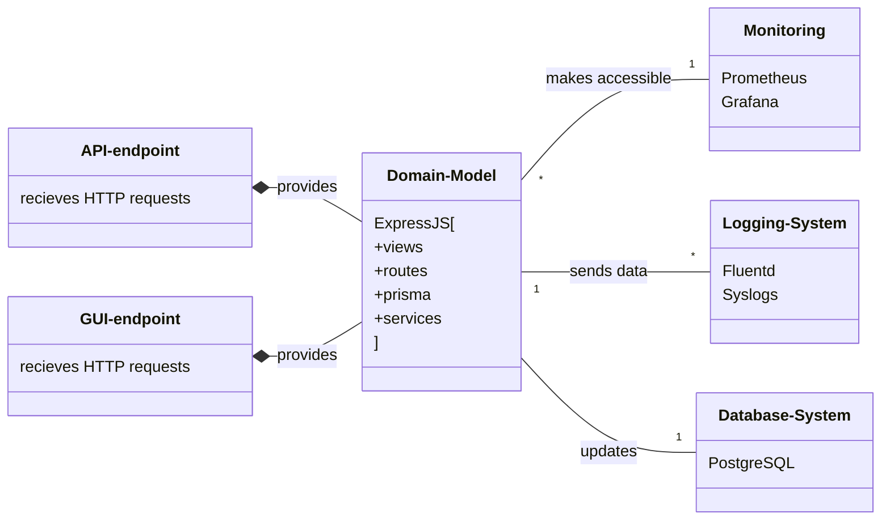
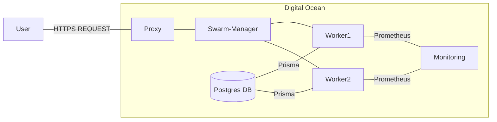
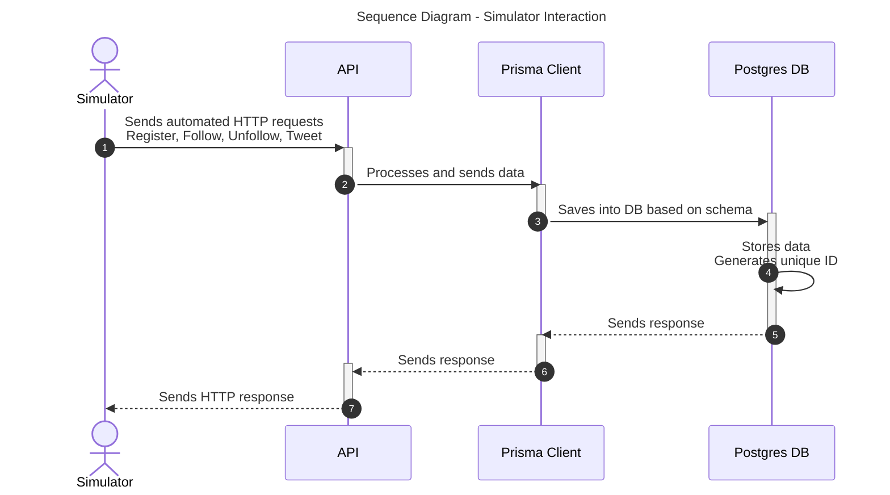
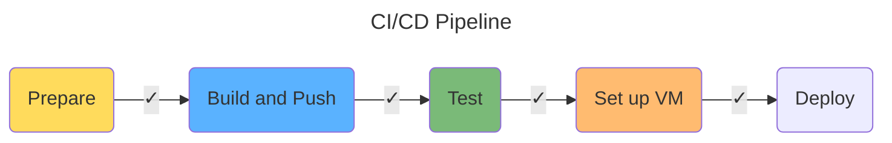
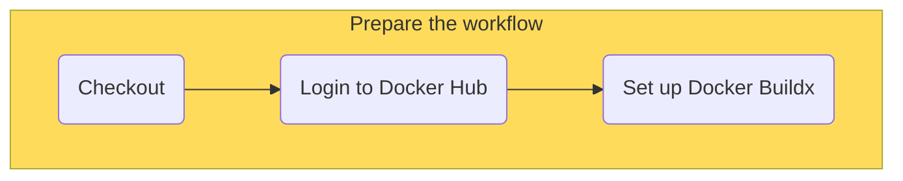
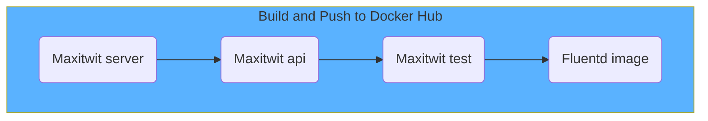
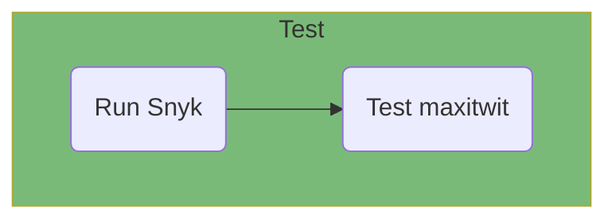
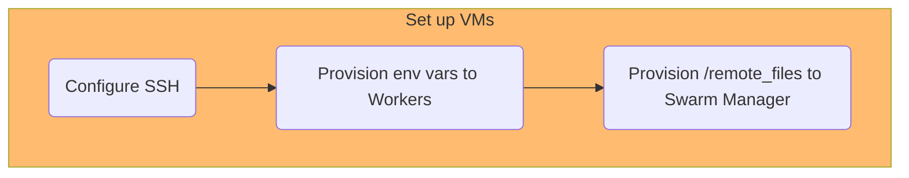

# DevOps, Software Evolution & Software Maintenance

## Group P, 2024

## Authors

| Name | Email |
|------|-------|
| Andreas Andrä-Fredsted | <aandr@itu.dk> |
| Bence Luzsinszky | <bluz@itu.dk> |
| Christian Emil Nielsen | <cemn@itu.dk> |
| Michel Moritz Thies | <mithi@itu.dk> |
| Róbert Sluka | <rslu@itu.dk> |

## System Perspective

### Architecture

### Dependencies

### Viewpoints

#### Module Viewpoint

The module viewpoint can be described as a mapping of functional requriements to static code blocks [SRC]. To effectively capture this, the following class diagram presents the components of the web-app mapped to their respective dependencies.

#### Components Viewpoint

#### Deplyoment Viewpoint

### Important interactions

The system can be interaceted with in two ways:

* [User Interface](https://maxitwit.tech)
* [API for the simulator](https://api.maxitwit.tech)

A user (or the simulator) can register, follow/unfollow other users and send tweets.

### Current State

## Process Perspective

Why: ExpressJS, Prisma, Postgres

### CI/CD pipline

Our CI/CD pipleine is based on **Github Actions**. We have a [deploy.yml](https://github.com/DevOps-2024-group-p/maxitwit/blob/main/.github/workflows/deploy.yml) file that is automatically triggered when new data is pushed to the **release branch**.

### Monitoring

### Security Assesment

### Scaling strategy

## Lessons Learned

* evolution and refactoring
  * Implementation of Logging
The evolution to the docker swarm architecture made the reconfiguration of subsystems a necessity. Specifically the reimplementation of logs proved difficult, as we had to sync logs across workers. To achieve this, it was attempted to have fluentd containers in each worker gather logs and send them to a seperate digital ocean droplet with elasticsearch and kibana running. This however proved infeasable within the constraints of this class, as elasticsearch kept crashing due to the limited resources provided to it on the droplet. Thus, we defaulted to store logs in a /logs folder on the droplet also containing the load balancer. Overall, this proved a learning experience for how a change to the tech-stack can make other segments obsolete, thus increasing the amount of refactoring required for a change to be feasible. In this specific case, a migration to the EFK-stack before the implementation of the docker swarm would have allowed for a more seemless and robust evolution of the application.
* operation
* maintenance
