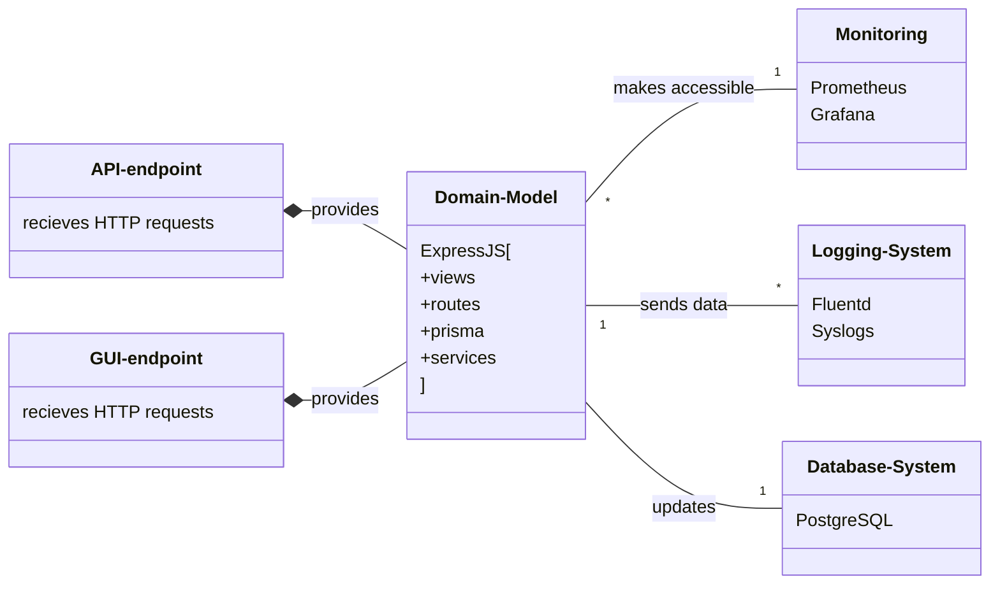
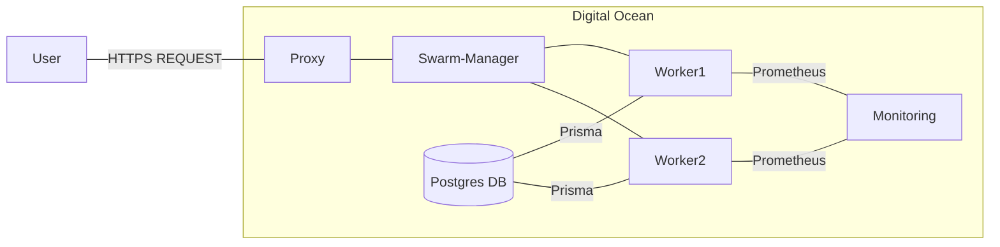
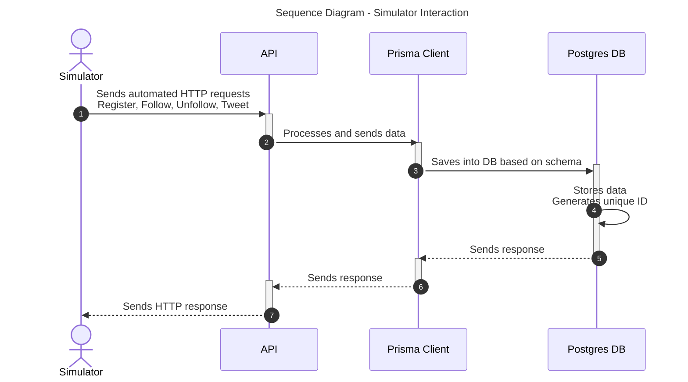

# DevOps, Software Evolution & Software Maintenance

## Group P, 2024

## Authors

| Name | Email |
|------|-------|
| Andreas Andrä-Fredsted | <aandr@itu.dk> |
| Bence Luzsinszky | <bluz@itu.dk> |
| Christian Emil Nielsen | <cemn@itu.dk> |
| Michel Moritz Thies | <mithi@itu.dk> |
| Róbert Sluka | <rslu@itu.dk> |

## System Perspective

### Viewpoints

#### Module Viewpoint

#### Components Viewpoint

#### Deplyoment Viewpoint

### Important interactions

## Process Perspective

## Lessons Learned
