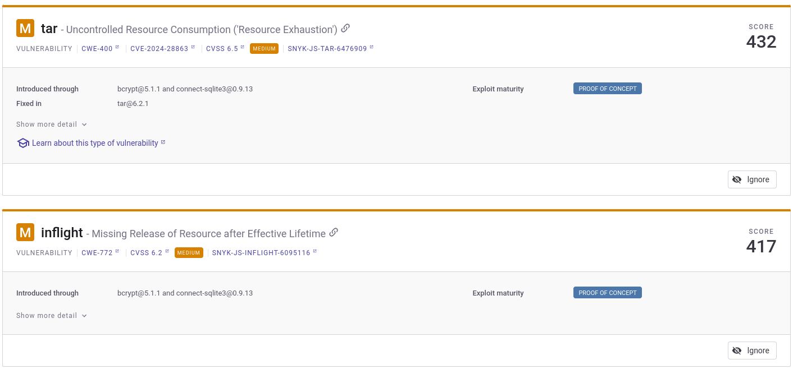
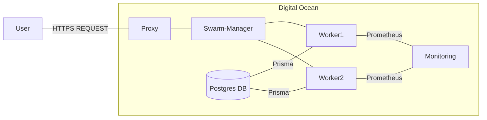
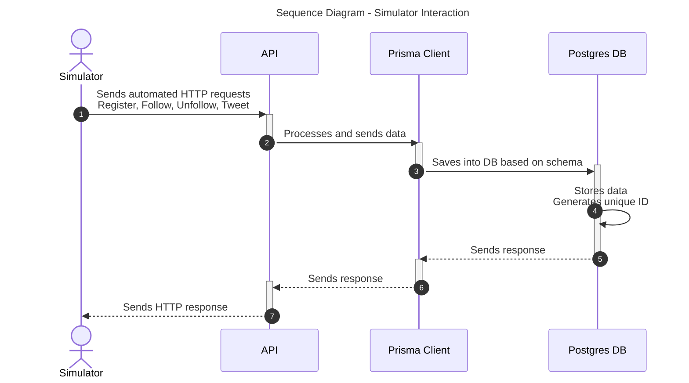
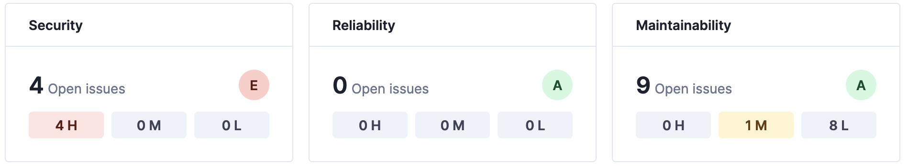
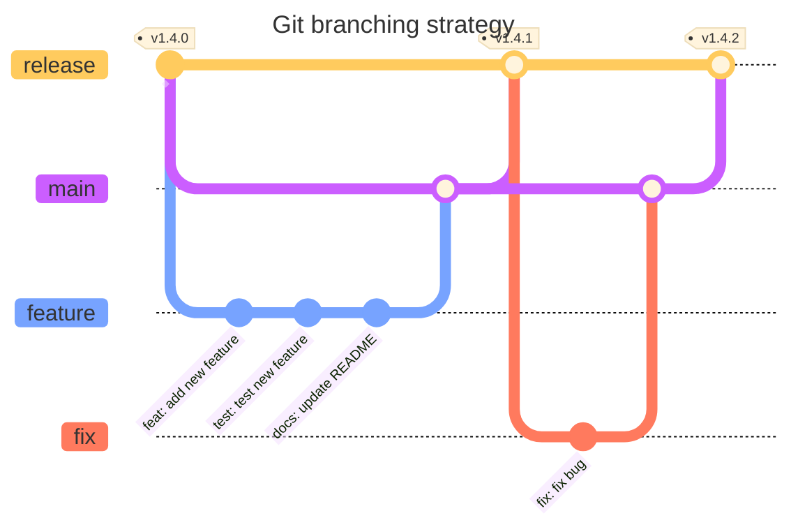
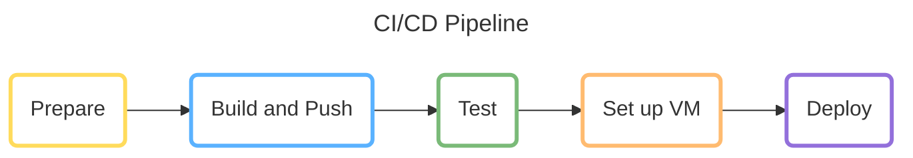
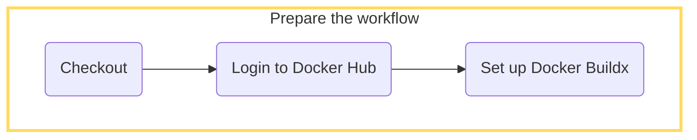
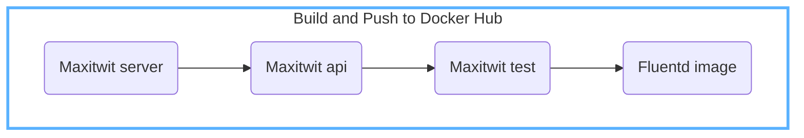
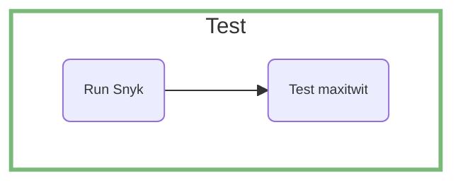
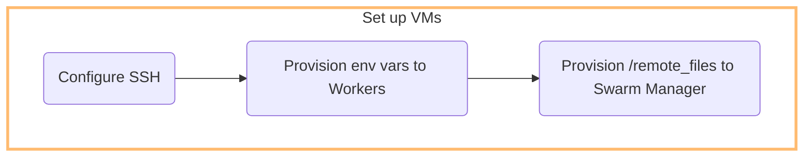

\newpage
TODO: add abstract

# System Perspective

## Architecture

The application was refactored from Python using Flask and replacing it with Javascript using Node.js runtime, Express and framework and Pug. The group decided to do the rewrite using Javascript as all members were already familiar with it to varying degrees and because of the good ecosystem which offers tools for everything we need in this web application. Javascript remains a popular and [relevant](https://pypl.github.io/PYPL.html) language to learn.

### Description of Components

#### Frontend

The frontend of our maxitwit application consists of HTML and CSS which is being rendered using the Pug templating engine. The frontend handles user input and sends requests to the express server while also displaying all data it receives as response.

#### Backend API

TODO: make headings more natural
The backend is developed using Node.js and utilizing the express framework for the server.

**Node.js**

We decided to use Node.js as it is the most popular and mature runtime environment for building fast and scalable server side applications in Javascript. We could have written the entire server logic in Javascript using just Node.js but decided this would be too big of an undertaking for the scope of this project.

**Express**

Instead of writing the server side logic completely from scratch we decided to use the Express framework as it comes with a number of useful features for developing robust server-side applications. Using the Express framework we have a minimal yet flexible framework that provides middleware support, so middleware functions can be used to handle HTTP requests and responses, as well as Route Handling allowing us to define routes for a number of HTTP methods such as GET, POST, PUT, DELETE and the corresponding url patterns.
Furthermore it offers a number of HTTP Utilities to simplify sending responses and accessing request data.
Another useful feature for us is the static file serving provided by the framework which we use to serve our CSS styles. To render our HTML content dynamically Express also offer template engine support, in our case for Pug. Finally the good support for Error Handling in the framework is essential when developing and maintaining complex application logic.

For identifying and fixing vulnerabilities, we used Snyk, which provided us with detailed reports on a weekly basis. These potential vulnerabilities were categorized based on their severity and then addressed. However, not all of them have been resolved, such as [inflight](https://security.snyk.io/vuln/SNYK-JS-INFLIGHT-6095116), which appears to no longer be maintained, and therefore, no current fix is available.

 TODO: Prisma/Database description
TODO: how express to database connected (is it extendable/ modifiable      etc.. )

## Viewpoints

### Module Viewpoint

To effectively capture this, the following class diagram presents the components of the web-app mapped to their respective dependencies.

The above module viewpoint highlights how the expressjs application interacts with numerous systems with some being
dependencies required for the running of the application, such as the postgres database, while others are tools meant for
tasks such as monitoring and logging. What is not covered in this illustration is the framework in which the application is run and managed,
which is covered in the following viewpoints.

### Deployment Viewpoint

Our application is deployed on a Digital Ocean droplet. The droplet is running a Docker Swarm with one manager and two worker nodes. We use an Nginx reverse proxy to route the incoming requests and monitoring is also running in a separate droplet.

In total we have 5 droplets and a database running on Digital Ocean.

We chose Digital Ocean because Github Education provides 200$ in credits for students, which was enough to cover the costs of the droplets and the database for the duration of the project.

## Important interactions

The system can be interaceted with in two ways:

* [User Interface](https://maxitwit.tech)
* [API for the simulator](https://api.maxitwit.tech)

The main interaction with the system is via an API, that is built for a simulator. The simulator sends HTTP requests to our endpoints to simulate a user registering, following, unfollowing and tweeting. The API uses Prisma to interact with the Postgres database. Prisma is an ORM that generates SQL queries based on the schema defined in the [Prisma schema file](https://github.com/DevOps-2024-group-p/maxitwit/blob/feature/report/prisma/schema.prisma).

We chose prisma because it is a modern ORM that is easy to use and has a lot of features that make it easy to interact with the database.

## Current State

TODO: add static and quality assessment  (is the code extendable) Which requirements did we meet and which didn't we meet.
TODO: github issues

The application is practically fully functional, apart from a single outstanding [bug](https://github.com/DevOps-2024-group-p/maxitwit/issues/42). While the application has [minimal technical debt](https://sonarcloud.io/summary/overall?id=fridge7809_maxitwit), it relies on legacy code and dependencies to test the application (test suite and simulator).

# Process Perspective

Why: ExpressJS, Prisma, Postgres
TODO: section on decision-making (milestone decisions) (a why under each choice !)
TODO: how AI was used in this project
TODO add description on Grafana and Prometheus component (from express to db)
TODO: add description of how postgres connection works (from express to db)

## Branching strategy

The chosen branching strategy loosely follows the [Gitflow](https://www.atlassian.com/git/tutorials/comparing-workflows/gitflow-workflow) workflow. We chose to omit hotfix branches and merge the concept of a main/develop branch for simplicity. Committing to main or release is not allowed only pull requests.

Opening a pull request from a feature branch to main triggers the CI pipline.

Succesfully merging a pull request to the release branch triggers the CD pipeline. Release tag is bumped according to the contents of the release, using the [semantic versioning](https://semver.org/) protocol.

## Commit hooks

A pre-commit hook was added in [d40fcba](https://github.com/DevOps-2024-group-p/maxitwit/commit/d40fcba312eb082bda44bd220887f3d7574a7a40) to lint and enforce commit messages and to follow the [semantic versioning](https://semver.org/) protocol. A [CLI-tool](https://github.com/commitizen/cz-cli) was also [added](https://github.com/DevOps-2024-group-p/maxitwit/commit/44eec0ba28e7cad2000d6f1bcbf9db3c667b3862) to aid developers write commit messages that follows the chosen protocol. Effectively standardizing a common development process, improving our process quality and readability of the git log.

## CI/CD pipline

Our CI/CD pipleine is based on **Github Actions**. We have a [deploy.yml](https://github.com/DevOps-2024-group-p/maxitwit/blob/main/.github/workflows/deploy.yml) file that is automatically triggered when new data is pushed to the **release branch**.

We prepare the workflow by checking out to our release branch, logging in to Docker Hub and setting up Docker Buildx so the workflow can build the images.

Th workflow builds our images and pushes them to Docker Hub.

Snyk is run to check for vulerabilities. After the workflow builds our images and runs our tests suite against them.

The environment variables stored in GitHub Actions Secrets are given to the workers and the most recent [/remote_files](https://github.com/DevOps-2024-group-p/maxitwit/tree/main/remote_files) are copied with SCP to the Swarm Manager.

Finally we SSH onto the Swarm Manager and run the [deploy.sh](https://github.com/DevOps-2024-group-p/maxitwit/blob/main/remote_files/deploy.sh) script to pull and build the new images.

## Monitoring

We use Prometheus and Grafana for [monitoring](http://144.126.246.214:3002/d/c8583637-71f4-4803-a0ed-f63485c5c3e6/group-p-public-dashboard?orgId=1&from=1715001375446&to=1715004975446).
There are multiple metrics set up in our backend, that are sent to /metrics enpoint on our both our [GUI](https://maxitwit.tech/metrics) and the [API](http://api.maxitwit.tech/metrics).
Prometheus scrapes these endpoints and Grafana visualizes the data.

We set up a separate Droplet on DigitalOcean for monitoring, because we had issues with its resource consumption. The monitoring droplet runs Prometheus and Grafana, and scrapes the metrics from the Worker nodes of the Docker swarm.

## Logging

TODO: add section on Logging
The Logging system started out a simple [logger](../src/services/logger.js) using the winston npm package to watch the application and its responses. To make logging system scale in a distributed context, the logger was reconfigured to send the gathered logs to a [fluentd instance](../remote_files/fluentd.conf) listening on port 24224, which then send the logs to be stored in the same droplet containing the load balancer.
Fluentd specifically was chosen over other similar alternatives such as Logstash for it's provided flexibility and integration with other services, as the decision whether to integrate logging into elasticsearch had not been made at the time. Thus, Fluentd provided a scalable solution that could fit with multiple evolution paths.

## Security Assesment

A severe vulnerability we found is that many of our containerized services executed process as root. This included images that ran in our CI/CD pipeline. This is a security risk because it violates [PloP](https://www.paloaltonetworks.com/cyberpedia/what-is-the-principle-of-least-privilege).

According to the documentation that can be found [Restricitons to ssh](https://superuser.com/questions/1751932/what-are-the-restrictions-to-ssh-stricthostkeychecking-no), we are aware that setting the flag for StrictHostKeyChecking to "no", might result in malicious parties being able to access the super user console of our system. Setting it to yes would prevent third parties from entering our system and only known hosts would be able to.

[NPM](https://www.npmjs.com/) was used to manage and audit dependencies with security vulnerabilities with `npm audit`. It was a challenge to upgrade certain dependencies, either because they were bundled or because they create cyclic dependencies. We generated a [dependency graph](./images/dependency_graph.svg) for our dependencies.

## Scaling strategy

TODO: add sentence on why distributed systems are great !
We used Docker Swarm for horizontal scaling. The strategy is defined in [compose.yml](https://github.com/DevOps-2024-group-p/maxitwit/blob/main/remote_files/compose.yaml).
One manager node is responsible for the load balancing and the health checks of two worker nodes.
Worker nodes we have 6 replicas of the service running.
We update our system with rolling upgrades. The replicas are updated 2 at a time, with 10s interval between the updates. The health of the service is monitored every 10s. If the service fails, it will be restarted with a maximum of 2 attempts.

# Lessons Learned

TODO: add paragraphing

## Evolution and refactoring

### State in a Load Balanced System

The implementation of the swarm and application droplets raised an issue related to the state in case a user would be forced to switch from one droplet to the other. The express-session npm package used to handle sessions in the GUI made use of a sqlite database running locally in the application. Thus, users of the GUI could face random logouts or database errors as the session-secret used to identify the user would be lost when switching droplet. To fix this issue, we discussed ways to manage session-handling using our postgres database or make a common droplet for session handling using sqlite. This would however require a complete refactoring of the session-handling. This proved an important lesson for the other issues raied by the migration to docker swarm, as many of our early implementations on the website where not scalable in a distributed framework.

### Implementation of Logging

The implementation of the logging system proved difficult, especially as the system was prepared for scaling using docker swarm. Originally, a simple syslogs setup inside a droplet was created which was managed by the npm packaged winston and morgan. This solution proved inscalable in a docker swarm framework, as there would be no centralized logging. Thus, we attempted to expand on the system by adding a fluentd container to each droplet, which would recieve the logs from the winston npm package and send them all to a centralized storage droplet running elasticsearch and kibana. This however failed as the Elasticsearch integration kept crashing due to memory issues. To still provide centralized logs, we defaulted to have fluentd send logfiles to the droplets running the load balancers, which would store them in a /logs folder.
Reflecting on this experience, had we from the beginning worked on implementing a scalable logging system, the amount of refactoring and experiential learning required for the implementation of the EFK-stack would have been diminished. In other words, it shows how technical debt can hinder the scaling of software solutions in practice.

### Database Migration

The Database Migration task presented in session 6 of the course proved a challenge for our team.
Even with the abstraction layer provided by Prisma, we ran into issues with certain namespaces not being allowed in postgresql.
Furthermore, simply dumping the sqlite database and running the dump against a postgres droplet on Digital Ocean would not work, as certain types were not compatible between the database. Specifically, the TIMESTAMP type in sqlite proved difficult, as postgres stores timestamps as integers. 
Over multiple attempts, we tried to modify the sql dump using different regex, `sed` commands and [bash scripts](https://github.com/DevOps-2024-group-p/maxitwit/issues/49), and then using an ssh connection to run the script against the postgresql droplet. This proved fatal however, as the script had not finished running after five hours due to each insert statement requiring a new connection. Furthermore we lost some data as we transitioned the application to make use of the postgresql droplet during the running of this script, 
which resulted in conflicting id's, as our insert statements still had the original id's present, which conflicted with the ones postgresql was generating as new requests were sent from the API. In th end, the solution was found in the shape of a pythonscript, which represented insert statements as classes, where each attribute in the insert statement was modified in the constructor of the class to match the postgresql schema, before being aggregated into insert statements and run. This also allowed us to run 1000 insert statements per connection, making the migration script only run 5 minutes before completion. 
This experience showed us that even with abstraction layers, such as prisma, unique issues related to our migration occured which necessitated the development of a specific solution. 

## Operation

During the last week of the simulator being active, our application crashed which we ended up not noticing.
The reason for the crash, which became clear when inspecting the docker logs, was that a misconfiguration in Fluentd
stopped the API- and GUI- containers from running, thereby bringing the entire application to a standstill.
The issue seemed to be that Fluentd was not configured to deal with certain logs, which led to the system rebooting.
The logs of this crash are lined [here]. Such an issue would have been difficult to foresee, as it was isolated to a specific subset of
events occuring in tandem. Furthermore, it was trivial to solve when we became aware of it, as it only required a slight modification in how logs were matched and transported out of fluentd.
 The larger issue at hand was that our monitoring system failed to inform us of this crash, which was caused by Prometheus having crashed around the same time. Thus, a set of systems set up to monitor and log the system had failed with no relation to eachother, allowing for the issue to go unnoticed.
 Thus, even though unlikely, the independant failure of multiple systems should be expected and guarded against.
 In our case, further manual testing of the website on a regular basis was deemed sufficient, however, it was discussed whether
 a shell script could be created to run get requests against the Api could be created, to have a continuous, reliant, status of the webapp.

## Maintenance

### Issues with monitoring

Our inbuilt metrics for prometheus turned out to be [very resource demanding](https://github.com/DevOps-2024-group-p/maxitwit/issues/83). So much that building the Prometheus container instantly started using 100% CPU and RAM of our droplet. This was solved by reducing the unnecesarry metrics and moving the Monitoring to its own droplet.

### Maintaining a performant DB

We noticed the performance of the public timeline endpoint getting slower as the database grew. To remedy this, we [wrote a shell script](https://github.com/DevOps-2024-group-p/maxitwit/blob/fd72ed600e3e7d8e6e8a5d96885e52b495a0b85e/sql/grab_perf_stats.sql) to query the performance table of our production database to [identify which relations needed indices](https://github.com/DevOps-2024-group-p/maxitwit/pull/79).
