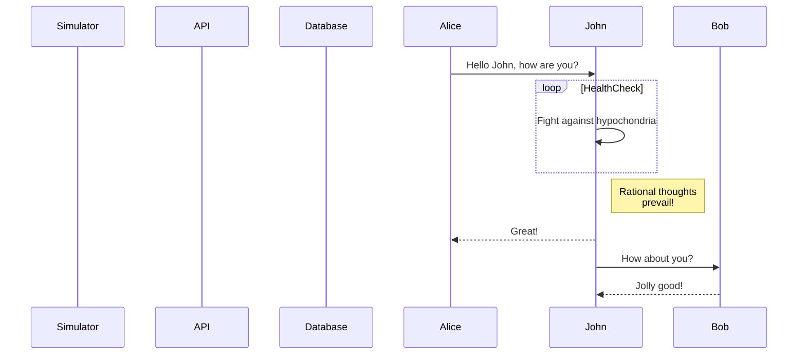
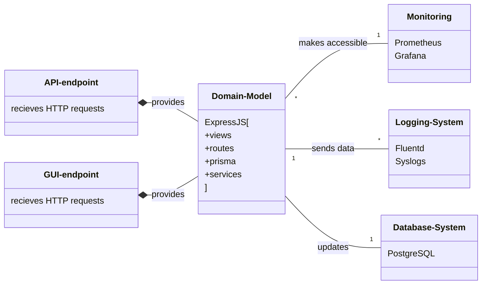
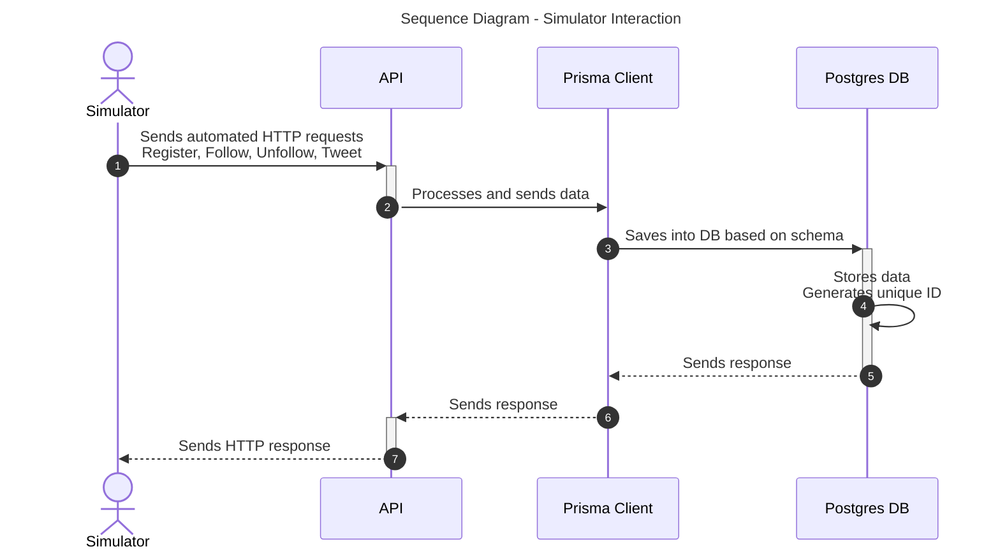

# DevOps, Software Evolution & Software Maintenance

## Group P - 2024

## Authors

| Name | Email |
|------|-------|
| Andreas Andrä-Fredsted | <aandr@itu.dk> |
| Bence Luzsinszky | <bluz@itu.dk> |
| Christian Emil Nielsen | <cemn@itu.dk> |
| Michel Moritz Thies | <mithi@itu.dk> |
| Róbert Sluka | <rslu@itu.dk> |

## System's Perspective

### Sequence diagram, simulator

### Sequence diagram, application

### Module Viewpoint

### Components Viewpoint

### Deplyoment Viewpoint

## Process' Perspective

## Lessons Learned

- evolution and refactoring
  - Implementation of Logging
The evolution to the docker swarm architecture made the reconfiguration of subsystems a necessity. Specifically the reimplementation of logs proved difficult, as we had to sync logs across workers. To achieve this, it was attempted to have fluentd containers in each worker gather logs and send them to a seperate digital ocean droplet with elasticsearch and kibana running. This however proved infeasable within the constraints of this class, as elasticsearch kept crashing due to the limited resources provided to it on the droplet. Thus, we defaulted to store logs in a /logs folder on the droplet also containing the load balancer. Overall, this proved a learning experience for how a change to the tech-stack can make other segments obsolete, thus increasing the amount of refactoring required for a change to be feasible. In this specific case, a migration to the EFK-stack before the implementation of the docker swarm would have allowed for a more seemless and robust evolution of the application.
- operation
- maintenance
