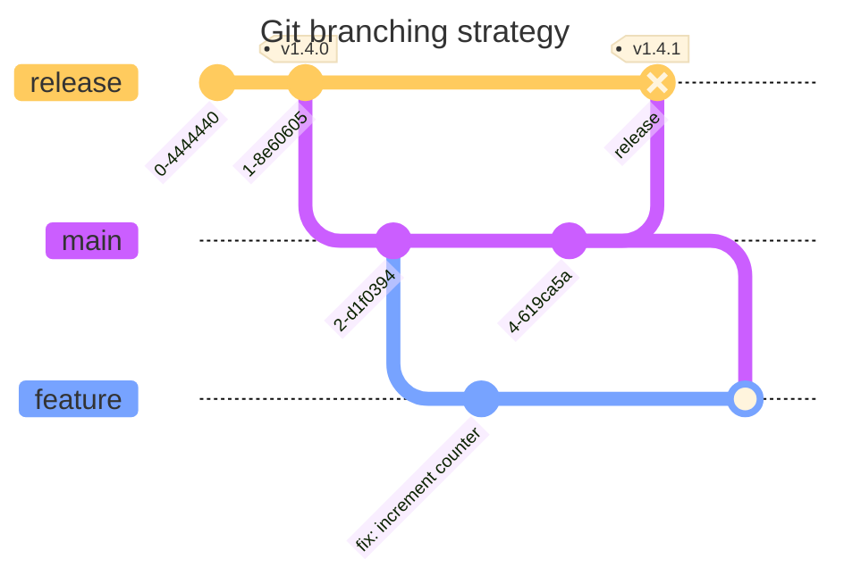

# DevOps, Software Evolution & Software Maintenance

## Group P, 2024

## Authors

| Name | Email |
|------|-------|
| Andreas Andrä-Fredsted | <aandr@itu.dk> |
| Bence Luzsinszky | <bluz@itu.dk> |
| Christian Emil Nielsen | <cemn@itu.dk> |
| Michel Moritz Thies | <mithi@itu.dk> |
| Róbert Sluka | <rslu@itu.dk> |

## System Perspective

### Architecture

### Dependencies

### Viewpoints

#### Module Viewpoint

To effectively capture this, the following class diagram presents the components of the web-app mapped to their respective dependencies.

The above module viewpoint highlights how the expressjs application interacts with numerous systems with some being
dependencies required for the running of the application, such as the postgres database, while others are tools meant for
tasks such as monitoring and logging. What is not covered in this illustration is the framework in which the application is run and managed,
which is covered in the following viewpoints.

#### Components Viewpoint

#### Deployment Viewpoint

### Important interactions

The system can be interaceted with in two ways:

* [User Interface](https://maxitwit.tech)
* [API for the simulator](https://api.maxitwit.tech)

A user (or the simulator) can register, follow/unfollow other users and send tweets.

### Current State

The application is practically fully functional, apart from a single outstanding [bug](https://github.com/DevOps-2024-group-p/maxitwit/issues/42). While the application has [minimal technical debt](https://sonarcloud.io/summary/overall?id=fridge7809_maxitwit), it relies on legacy code and dependencies to test the application (test suite and simulator).

## Process Perspective

Why: ExpressJS, Prisma, Postgres

## Branching strategy

The chosen branching strategy loosely follows the [Gitflow](https://www.atlassian.com/git/tutorials/comparing-workflows/gitflow-workflow) workflow. We chose to omit hotfix branches and merge the concept of a main/develop branch for simplicity. CI pipeline is triggered on open pull-requests from feature to main. CD pipeline is triggered on new commits on release. Release tag is bumped according to the contents of the release, using the [semantic versioning](https://semver.org/) protocol.

### Commit hooks

A pre-commit hook was added in [d40fcba](https://github.com/DevOps-2024-group-p/maxitwit/commit/d40fcba312eb082bda44bd220887f3d7574a7a40) to lint and enforce commit messages and to follow the [semantic versioning](https://semver.org/) protocol. A [CLI-tool](https://github.com/commitizen/cz-cli) was also [added](https://github.com/DevOps-2024-group-p/maxitwit/commit/44eec0ba28e7cad2000d6f1bcbf9db3c667b3862) to aid developers write commit messages that follows the chosen protocol. Effectively standardizing a common development process, improving our process quality and readability of the git log.

### CI/CD pipline

Our CI/CD pipleine is based on **Github Actions**. We have a [deploy.yml](https://github.com/DevOps-2024-group-p/maxitwit/blob/main/.github/workflows/deploy.yml) file that is automatically triggered when new data is pushed to the **release branch**.

We prepare the workflow by checking out to our release branch, logging in to Docker Hub and setting up Docker Buildx so it can build the images.

Th workflow builds our images and pushes them to Docker Hub.

The workflow runs snyk to check for vulerabilities, then builds our images and runs our tests suite against them.

The environment variables stored in GitHub Actions Secrets are given to the workers and the most recent [/remote_files](https://github.com/DevOps-2024-group-p/maxitwit/tree/main/remote_files) are SCPd to the Swarm Manager.

Finally we SSH onto the Swarm Manager and run the [deploy.sh](https://github.com/DevOps-2024-group-p/maxitwit/blob/main/remote_files/deploy.sh) script to pull and build the new images.

### Monitoring

We use Prometheus and Grafana for [monitoring](http://144.126.246.214:3002/d/c8583637-71f4-4803-a0ed-f63485c5c3e6/group-p-public-dashboard?orgId=1&from=1715001375446&to=1715004975446).
There are multiple metrics set up in our backend, that are sent to /metrics enpoint on our both our [GUI](https://maxitwit.tech/metrics) and the [API](http://api.maxitwit.tech/metrics).
Prometheus scrapes these endpoints and Grafana visualizes the data.

We set up a separate Droplet on DigitalOcean for monitoring, because we had issues with its resource consumption. The monitoring droplet runs Prometheus and Grafana, and scrapes the metrics from the Worker nodes of the Docker swarm.

### Security Assesment

* TODO sentence about our pipelines using root users which violates [PloP](https://www.paloaltonetworks.com/cyberpedia/what-is-the-principle-of-least-privilege)

According to the documentation that can be found [Restricitons to ssh](https://superuser.com/questions/1751932/what-are-the-restrictions-to-ssh-stricthostkeychecking-no), we are aware that setting the flag for StrictHostKeyChecking to "no", might result in malicious parties being able to access the super user console of our system. Setting it to yes would prevent third parties from enterying our system and only known hosts would be able to.

### Scaling strategy

We used Docker Swarm for horizontal scaling. The strategy is defined in [compose.yml](https://github.com/DevOps-2024-group-p/maxitwit/blob/main/remote_files/compose.yaml).
One manager node is responsible for the load balancing and the health checks of two worker nodes.
Worker nodes we have 6 replicas of the service running.
We update our system with rolling upgrades. The replicas are updated 2 at a time, with 10s interval between the updates. The health of the service is monitored every 10s. If the service fails, it will be restarted with a maximum of 2 attempts.

## Lessons Learned

* evolution and refactoring
  * Implementation of Logging
The evolution to the docker swarm architecture made the reconfiguration of subsystems a necessity. Specifically the reimplementation of logs proved difficult, as we had to sync logs across workers. To achieve this, it was attempted to have fluentd containers in each worker gather logs and send them to a seperate digital ocean droplet with elasticsearch and kibana running. This however proved infeasable within the constraints of this class, as elasticsearch kept crashing due to the limited resources provided to it on the droplet. Thus, we defaulted to store logs in a /logs folder on the droplet also containing the load balancer. Overall, this proved a learning experience for how a change to the tech-stack can make other segments obsolete, thus increasing the amount of refactoring required for a change to be feasible. In this specific case, a migration to the EFK-stack before the implementation of the docker swarm would have allowed for a more seemless and robust evolution of the application.
* operation
* maintenance

### Maintaining a performant DB

We noticed the performance of the public timeline endpoint getting slower as the database grew. To remedy this, we [wrote a shell script](https://github.com/DevOps-2024-group-p/maxitwit/blob/fd72ed600e3e7d8e6e8a5d96885e52b495a0b85e/sql/grab_perf_stats.sql) to query the performance table of our production database to [identify which relations needed indices](https://github.com/DevOps-2024-group-p/maxitwit/pull/79).
